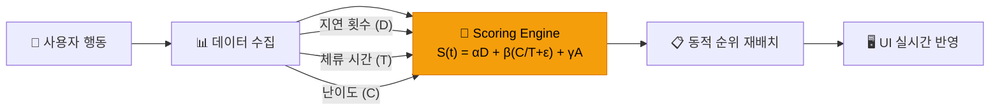
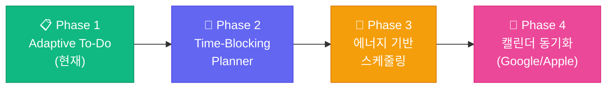

<div align="center">

# 🧠 Team-Sigma: Adaptive Task Manager

**"할 일을 기록하는 것이 아니라, 행동을 바꾸는 도구."**

사용자의 지연·회피 패턴을 학습하고, 수학적 모델과 AI가 협력하여<br/>
정말로 지금 해야 할 일을 스스로 떠올려 주는 적응형 태스크 매니저.

[](https://nextjs.org/)
[](https://www.typescriptlang.org/)
[](https://ai.google.dev/)
[](https://vitest.dev/)

</div>

---

## 📌 문제 인식: 왜 To-Do List는 실패하는가

우리는 하루 평균 **35,000번의 결정**을 내립니다. 그 속에서 "무엇을 먼저 해야 하는가"라는 질문은 가장 에너지를 많이 소모하는 결정 중 하나입니다. 기존의 To-Do 앱은 이 문제를 해결하지 못합니다. 할 일을 **기록**할 수는 있지만, **결정**을 도와주지는 않기 때문입니다.

### 기존 도구의 한계

| 현상 | 심리학적 원인 | 기존 앱의 대응 |
|------|-------------|--------------|
| 가장 중요한 일을 계속 미룬다 | **심리적 회피** — 난이도가 높을수록 시작 자체를 꺼린다 | ❌ 없음 |
| 할 일이 많을수록 아무것도 못 한다 | **결정 장애(Decision Paralysis)** — 선택지 과부하 | ❌ 수동 정렬뿐 |
| 매일 같은 항목이 남아 있다 | **완벽주의 루프** — "제대로 할 수 있을 때" 기다림 | ❌ 감지 불가 |

### 우리의 해결책

> **Team-Sigma**는 단순한 기록 도구가 아니라, 사용자의 **행동 데이터**를 실시간으로 분석하여 뇌의 결정 부하를 줄여주는 **'적응형 태스크 매니저(Adaptive Task Manager)'** 입니다.

- 📊 사용자가 어떤 작업을 **몇 번 미뤘는지**, **얼마나 오래 들여다봤는지** 추적합니다.
- 🧮 이 데이터를 수학적 공식에 넣어 **지금 해야 할 일의 순서**를 자동으로 재배치합니다.
- 🤖 계속 미루는 '악성 태스크'를 AI가 감지하고, **작은 단위로 쪼개는 제안**을 합니다.

---

## 🏗 아키텍처: 전략 패턴 (Strategy Pattern)

정렬 알고리즘을 하나의 클래스에 고정하지 않고, **전략 패턴(Strategy Pattern)** 으로 분리하여 런타임에 동적으로 교체할 수 있도록 설계했습니다.

```
┌──────────────────────────────────────────┐
│            SortingStrategy               │  ◀── 인터페이스
│  + sort(tasks: Task[]): Task[]           │
└──────────────┬───────────────────────────┘
               │
       ┌───────┴───────┐
       ▼               ▼
┌──────────────┐  ┌──────────────────────┐
│   Default    │  │     Adaptive         │
│  (마감일 순)  │  │ (데이터 기반 $S(t)$) │
└──────────────┘  └──────────────────────┘
```

사용자는 UI 토글 한 번으로 기본 정렬 ↔ AI 적응형 정렬을 전환할 수 있으며, 시스템은 어떤 전략이든 동일한 인터페이스로 처리합니다.

---

## 📐 핵심 알고리즘: 우선순위 산출 공식

### 공식 정의

임의의 태스크 $t$에 대해 우선순위 점수를 다음과 같이 산출합니다:

$$S(t) = \alpha \cdot D(t) + \beta \cdot \frac{C(t)}{T(t) + \epsilon} + \gamma \cdot A(t)$$

### 각 변수의 의미 (실생활 연결)

| 변수 | 수학적 의미 | 실생활 해석 | 예시 |
|------|-----------|-----------|------|
| $D(t)$ | 지연 횟수 (deferCount) | "이 일을 몇 번이나 내일로 미뤘는가" | 5번 미룬 운동 → 점수 급상승 |
| $C(t)$ | 난이도 (difficulty, 1~5) | "이 일이 얼마나 어렵게 느껴지는가" | 논문 작성 = 5점 |
| $T(t)$ | 체류 시간 (detailPageStayTime) | "이 일을 얼마나 오래 들여다봤는가" | 30초 보고 닫음 = 심리적 장벽 |
| $A(t)$ | AI 우선순위 점수 (priority → 수치) | "AI가 판단한 긴급도" | high=3, medium=2, low=1 |
| $\epsilon$ | 분모 보정값 (0.001) | 체류 시간이 0일 때 분모가 0이 되는 것을 방지 | — |

### 우리가 이 수식을 선택한 이유

솔직히 말하면, 처음부터 이 공식이었던 건 아닙니다.

초기 버전에서는 단순히 마감일 순으로 정렬했습니다. 그런데 팀원들이 실제로 써보니 이상한 일이 벌어졌습니다. **마감이 먼 '논문 작성'은 매일 리스트 아래에 깔려 있다가, 마감 전날이 되어서야 최상단에 올라왔습니다.** 이미 손 쓸 수 없는 시점이었죠.

우리는 이 문제의 원인이 **'미루는 습관의 관성'** 에 있다고 판단했습니다. 미루는 행위는 한 번 시작되면 가속도가 붙습니다. 그래서 지연 횟수($D$)에 가장 높은 가중치 $\alpha = 10$을 부여했습니다. "자꾸 미루는 일이야말로 지금 당장 해야 할 일"이라는 것이 우리의 가설이었고, 실제로 효과가 있었습니다.

$\beta$ 항은 더 흥미로운 이야기가 있습니다. 팀원 한 명이 난이도 5짜리 작업을 등록한 뒤 상세 페이지를 **0.3초 만에 닫는** 패턴을 반복했습니다. "내용을 확인하려고 들어간 게 아니라, 보기만 해도 부담스러워서 바로 나간 것"이었죠. 이 관찰에서 $\frac{C}{T+\epsilon}$ 항이 탄생했습니다 — **어렵고 + 안 보는 일**이야말로 심리적 장벽이 가장 높은 작업이므로, 시스템이 먼저 끌어올려야 한다고 판단한 것입니다.

이것이 Brian Tracy의 'Eat the Frog' 원칙을 수학으로 번역한 우리만의 방법입니다.

### 가중치 ($\alpha$, $\beta$, $\gamma$)

| 가중치 | 기본값 | 우리의 철학 |
|--------|--------|------|
| $\alpha$ | 10 | 미루는 습관에는 관성이 있다. 가장 먼저 끊어내야 한다. |
| $\beta$ | 5 | 회피하는 일일수록 먼저 보여줘야 한다. 안 보면 영원히 안 한다. |
| $\gamma$ | 2 | AI의 판단은 참고 자료일 뿐, 최종 결정은 행동 데이터가 한다. |

### 데이터 흐름도



---

## 🐸 악성 태스크 감지 & AI 분할

### 감지 기준

시스템은 다음 조건 중 하나라도 충족하면 해당 태스크를 **'Stuck(악성)'** 상태로 분류합니다:

| 조건 | 기준 | 심리학적 근거 |
|------|------|-------------|
| 과도한 지연 | `deferCount ≥ 5` | 5번 이상 미룬 일은 의지의 문제가 아닌 **구조의 문제** |
| 장기 방치 | 생성 후 `7일` 경과 | 일주일간 손대지 않은 일은 현재 형태로는 실행 불가능 |
| 조기 감지 | 난이도 `≥ 4` + 체류 시간 `0` + `3일` 경과 | 어렵고 쳐다보지도 않는 일 = **심리적 장벽** |

### AI 생산성 코치

Stuck 태스크가 감지되면, AI가 **'생산성 코치'** 역할로 개입합니다:

```
⚠️ 이 작업이 계속 미뤄지고 있네요. 작은 단위로 쪼개볼까요?

    [나중에]  [태스크 분할하기]
```

AI 코치는 냉소적으로 재촉하는 것이 아니라, 사용자의 회피 심리에 **공감하면서도 구체적인 해결책을 제시하는 파트너**의 톤을 유지합니다.

- ❌ ~~"이 일을 왜 아직도 안 했나요?"~~
- ✅ **"이 작업이 계속 미뤄지고 있네요. 혹시 시작이 어려운 건 아닐까요? 작은 단위로 쪼개면 첫 발을 내딛기 훨씬 수월해집니다."**

분할 시, AI는 다음 원칙을 준수합니다:
- 각 하위 태스크는 **30분 이내**에 완료 가능한 단위
- **구체적인 행동 동사**로 시작 (예: "조사하다", "작성하다")
- 모든 하위 태스크의 합이 **원본 범위를 벗어나지 않도록** 구성

### 거절 방어 (Cool-off)

사용자가 "나중에"를 선택하면, **24시간 동안** 해당 태스크에 대한 알림이 억제됩니다.
끊임없이 재촉하는 앱은 오히려 사용자의 이탈을 유발하기 때문입니다.

---

## ⚡ 성능 최적화: 캐싱 아키텍처

### 서버: AI 응답 캐시 (Fail-safe LRU)

```
[요청] → Cache 조회 ─── HIT ──→ 즉시 반환 (~5ms)
                    │
                    └── MISS ──→ Gemini API 호출 (~8s) → 결과 캐싱 → 반환
```

| 설계 원칙 | 구현 |
|----------|------|
| **버전 관리** | `PROMPT_VERSION`을 캐시 키에 포함 → 프롬프트 수정 시 과거 캐시 자동 무효화 |
| **Fail-safe** | 캐시 읽기/쓰기 실패 시에도 API 응답은 정상 진행 (서버리스 대비) |
| **확장성** | `CacheProvider` 인터페이스 → 향후 Redis/Upstash 교체 용이 |

### 클라이언트: 정렬 메모이제이션

태스크 배열의 **실질적 변경 여부**를 핑거프린트로 감지하여, 불필요한 고비용 정렬 연산을 제거합니다.

```typescript
// 정렬에 영향을 주는 필드만으로 서명 생성
const taskFingerprint = useMemo(() =>
  tasks.map(t => `${t.id}:${t.status}:${t.deferCount}:${t.difficulty}:...`).join('|'),
  [state.tasks]
);

// 핑거프린트가 동일하면 이전 정렬 결과를 재사용
const sortedTasks = useMemo(() => strategy.sort(tasks), [taskFingerprint, ...]);
```

---

## 🔮 미래 확장: Adaptive Planner로의 진화

현재의 Team-Sigma는 **To-Do 매니저**이지만, 데이터 구조는 이미 **Planner로의 확장**을 염두에 두고 설계되었습니다.

### 의도된 구조 (Planned Architecture)

| 현재 필드 | 현재 용도 | 미래 확장 |
|----------|----------|----------|
| `startTime` / `endTime` | PLAN 모드 시간 표시 | → **Time-Blocking** 캘린더 뷰 |
| `difficulty` (1~5) | 우선순위 공식 변수 | → **에너지 레벨 매칭** (고난도 = 오전, 저난도 = 오후) |
| `estimatedTime` | 예상 소요 시간 표시 | → **자동 일정 배치** (빈 시간 슬롯에 삽입) |
| `detailPageStayTime` | 회피 감지용 | → **집중도 분석** 및 포모도로 연동 |
| `deferCount` | Stuck 판별 | → **주간 생산성 리포트** 소스 데이터 |

### 로드맵



**Phase 2 — Time-Blocking Planner**
- PLAN 모드의 `startTime`/`endTime`을 활용한 드래그 앤 드롭 캘린더 뷰
- 예상 소요 시간(`estimatedTime`)으로 빈 시간 슬롯에 자동 배치 제안

**Phase 3 — 에너지 기반 스케줄링**
- 시간대별 사용자의 작업 완료율을 분석하여 '집중력 피크 타임'을 학습
- 고난도 작업은 피크 타임에, 저난도 루틴은 에너지 저하 시간대에 자동 배치

**Phase 4 — 캘린더 동기화**
- Google Calendar / Apple Calendar 양방향 동기화
- 외부 일정과 Team-Sigma 태스크의 충돌 감지 및 자동 리스케줄링

---

## 🛠 기술 스택

| 영역 | 기술 |
|------|------|
| **Framework** | Next.js 16 (App Router, Turbopack) |
| **Language** | TypeScript 5 |
| **Styling** | Tailwind CSS 4 |
| **AI Engine** | Google Gemini 2.5 Flash |
| **Testing** | Vitest + Testing Library |
| **Icons** | Lucide React |
| **State** | React Context + useReducer |
| **Caching** | In-Memory LRU (CacheProvider Interface) |

---

## 🏁 시작하기

### Prerequisites

- Node.js 18+
- Gemini API Key ([발급하기](https://ai.google.dev/))

### Installation

```bash
# 1. 저장소 클론
git clone https://github.com/realseok79/team_sigma.git

# 2. 의존성 설치
cd team_sigma && npm install

# 3. 환경 변수 설정
echo "GEMINI_API_KEY=your_api_key_here" > .env

# 4. 개발 서버 실행
npm run dev
```

### 테스트 실행

```bash
# 전체 테스트 실행 (14개)
npx vitest run

# 캐시 성능 벤치마크 (서버 실행 필요)
npx tsx scripts/benchmark.ts
```

---

## 💡 사용 예시

| 입력 | 결과 |
|------|------|
| `"중요! 내일 오후 2시 발표 준비하기"` | 📌 프레젠테이션 카테고리, 우선순위 HIGH, TO-DO |
| `"오후 3시부터 5시까지 미팅"` | 📅 PLAN 모드, 시작/종료 시간 자동 설정 |
| `"어둡게 해줘"` | 🌙 다크 모드 즉시 전환 |

---

## 📂 프로젝트 구조

```
team_sigma/
├── app/
│   ├── api/
│   │   ├── parse/          # AI 자연어 파싱 API (캐싱 적용)
│   │   └── split-task/     # AI 태스크 분할 API (캐싱 적용)
│   ├── layout.tsx
│   └── page.tsx            # 메인 화면
├── lib/
│   ├── sorting/
│   │   ├── SortingStrategy.ts        # 전략 패턴 인터페이스
│   │   ├── DefaultSortingStrategy.ts # 마감일 기반 정렬
│   │   └── AdaptiveSortingStrategy.ts # S(t) 공식 기반 정렬
│   ├── cacheManager.ts     # CacheProvider + LRU 캐시
│   ├── stuckTaskEngine.ts  # 악성 태스크 감지 엔진
│   ├── categoryEngine.ts   # 한국어 키워드 기반 분류
│   └── userHistory.ts      # 난이도 학습 이력 관리
├── context/
│   └── TaskContext.tsx      # 전역 상태 관리 (useReducer)
├── components/
│   ├── TaskCard.tsx         # 태스크 카드 (Stuck UI 포함)
│   └── NotificationManager.tsx # 알림 및 Stuck 감지
├── __tests__/               # TDD 테스트 (14개)
├── scripts/
│   └── benchmark.ts         # 캐시 성능 벤치마크
└── types.ts                 # 핵심 타입 정의
```

---

## 🔧 Behind the Code: 개발 비하인드

이 프로젝트의 모든 기능에는 우리가 직접 겪고, 고민하고, 실패했던 이야기가 담겨 있습니다.

### "마감일 순 정렬은 거짓말쟁이였다"

프로젝트 초기, 우리는 모든 할 일을 마감일 순으로 정렬하면 생산성이 올라갈 거라 믿었습니다. 하지만 2주간 팀원 4명이 직접 사용해본 결과, **정말 중요한 장기 과제는 항상 리스트 맨 아래에 묻혀 있었습니다.** 마감이 먼 일은 항상 '내일의 나'에게 미뤄졌고, 결국 마감 전날 밤샘으로 이어졌습니다.

이 경험이 적응형 알고리즘의 출발점이었습니다. "마감일은 중요한 지표지만, 유일한 지표여서는 안 된다." 우리는 이 깨달음에서 $S(t)$ 공식의 첫 번째 스케치를 화이트보드에 그렸습니다.

### "가중치 전쟁: 밤새 숫자를 바꾸다"

$\alpha$, $\beta$, $\gamma$ — 이 세 개의 숫자를 결정하기 위해 우리는 밤새 테스트를 반복했습니다. $\alpha$를 5로 놓으면 미루는 작업에 대한 반응이 너무 느렸고, 20으로 올리면 한 번만 미뤄도 최상단으로 튀어올라 오히려 혼란스러웠습니다. 수십 번의 시뮬레이션 끝에 10이라는 값에 도달했을 때, 팀원들이 "아, 이건 진짜 내가 해야 할 순서 같다"라고 말했던 순간을 아직도 기억합니다.

### "알림은 재촉이 아니라 공감이어야 한다"

초기 프로토타입에서는 Stuck 태스크가 감지되면 매분마다 알림을 띄웠습니다. 결과는? **팀원들이 알림을 끄고 앱 자체를 안 열었습니다.** 이 실패에서 'Cool-off(24시간 거절 방어)' 원칙이 탄생했습니다. 사용자를 괴롭히는 생산성 앱은 결국 사용되지 않는 앱이 된다는 것을 우리는 직접 체험했습니다.

---

## 🤝 Team-Sigma의 개발 원칙

우리는 코드를 쓰기 전에 원칙을 먼저 세웠습니다. 이 원칙들은 모든 기능의 설계 근거이자, 우리 팀의 정체성입니다.

> **1. 행동 변화 우선 (Behavior First)**
> 복잡한 기술보다 사용자의 행동 변화를 우선합니다. 기능이 아무리 정교해도 사용자가 실제로 할 일을 완료하지 않는다면 실패입니다.

> **2. 괴롭히지 않는 알림 (Cool-off Principle)**
> 불필요한 알림으로 사용자를 재촉하지 않습니다. 거절당한 제안은 24시간 동안 침묵합니다. 끈질긴 앱이 아니라 현명한 파트너가 되는 것이 목표입니다.

> **3. 데이터가 결정한다 (Data-Driven Decisions)**
> '중요하다고 느끼는 일'이 아니라 '행동 데이터가 말하는 일'을 먼저 보여줍니다. 직감은 편향되지만, 지연 횟수와 체류 시간은 거짓말을 하지 않습니다.

> **4. 의도된 구조 (Architecture with Intent)**
> 지금 당장 쓰지 않는 필드도, 미래의 확장을 위해 의도적으로 설계합니다. `startTime`, `estimatedTime`은 오늘의 편의가 아닌 내일의 Planner를 위한 포석입니다.

> **5. 솔직한 한계 인정 (Honest Reflection)**
> 완벽한 척하지 않습니다. 부족한 점을 알고, 기록하고, 다음 단계에서 개선합니다.

---

## 🪞 한계점 및 배운 점 (Reflection)

완벽한 프로젝트는 없습니다. 우리도 마찬가지입니다. 현재 Team-Sigma가 안고 있는 한계와, 이를 통해 배운 것들을 솔직하게 기록합니다.

### 현재의 한계

| 한계 | 원인 | 차기 단계 해결 방안 |
|------|------|------------------|
| **대용량 데이터 제한** | 모든 상태가 `localStorage`에 저장됨 (최대 ~5MB) | DB 연동 (Supabase/PlanetScale) |
| **멀티 디바이스 미지원** | 브라우저별 독립 저장소 | 클라우드 동기화 레이어 추가 |
| **캐시 인스턴스 격리** | 인메모리 LRU는 서버리스 환경에서 인스턴스별 독립 | Redis/Upstash로 CacheProvider 교체 |
| **가중치 고정** | $\alpha$, $\beta$, $\gamma$가 상수로 설정됨 | 사용자 데이터 기반 자동 튜닝 로직 |
| **AI 의존성** | Gemini API 장애 시 분할 제안 불가 | Fallback용 규칙 기반 분할 로직 |

### 배운 것

- **TDD는 자신감이다**: 수학 공식을 코드로 옮길 때, 테스트가 없었다면 가중치를 바꿀 때마다 공포에 떨었을 것입니다. 14개의 테스트가 우리에게 "마음껏 바꿔도 돼"라는 확신을 주었습니다.
- **사용자는 우리 생각보다 빨리 떠난다**: Cool-off 원칙은 이론이 아니라 실패에서 나왔습니다. 알림을 끈 팀원의 피드백 한 줄이 아키텍처 전체를 바꿨습니다.
- **인터페이스를 먼저 설계하라**: `CacheProvider`, `SortingStrategy` 인터페이스 덕분에 구현체를 교체할 때 나머지 코드를 한 줄도 건드리지 않았습니다. 이것이 전략 패턴의 진짜 가치입니다.

---

## 📄 License

This project is licensed under the MIT License.
